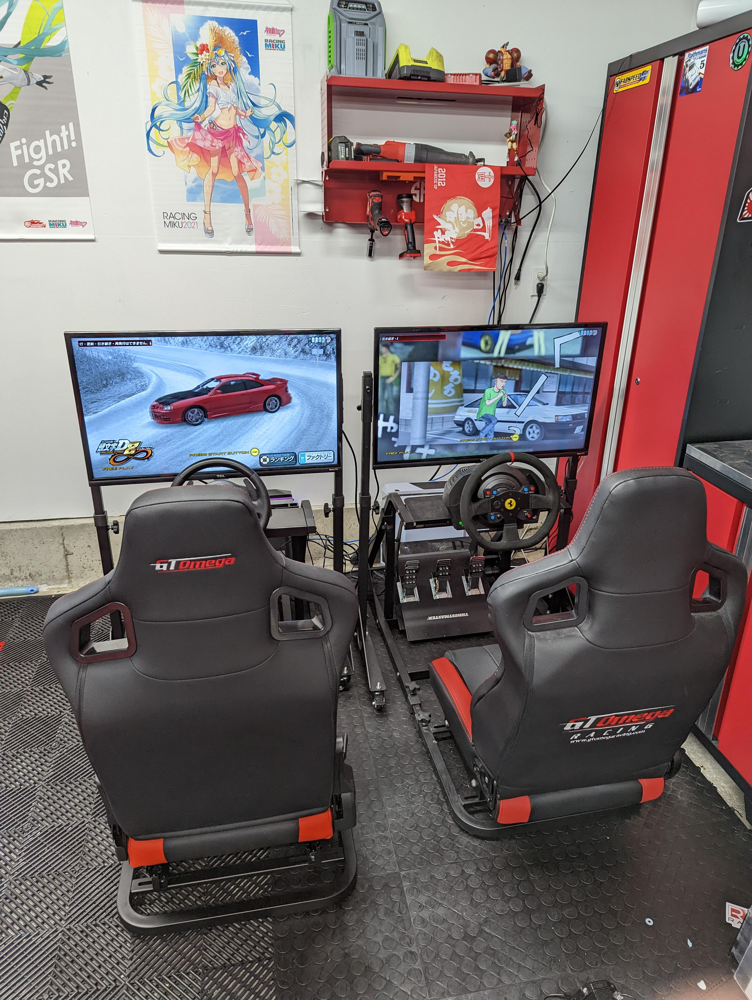

Initial D on RetroPie brings the classic arcade racing experience to the Raspberry Pi, offering fans a way to enjoy the iconic drift-based racing game through emulation. This setup combines the flexibility of the Raspberry Pi with RetroPie's emulation capabilities, making it a perfect choice for retro gaming enthusiasts looking to revisit the thrilling races and storyline of Initial D. When finished people will be able to enjoy the arcades experience in a portable environment and for a fraction of the cost of the cabinet (recently valued @ $20,00)

{: width="75%"}
{: style="text-align:center"}