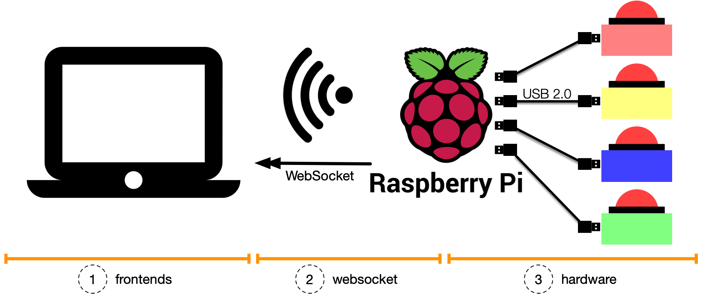

Creating a Jeopardy-style game on a Raspberry Pi offers a unique and interactive way to engage with educational content or entertainment through custom quizzes. Leveraging the Raspberry Pi for such projects is beneficial due to its low cost, portability, and flexibility, allowing for both simple and complex game designs that can be tailored to a wide range of audiences. Moreover, it provides a hands-on learning experience in coding and hardware integration, enhancing technical skills while offering a fun and engaging way to learn or present information.
This project is still under developement

{: width="75%"}
{: style="text-align:center"}