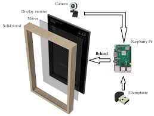
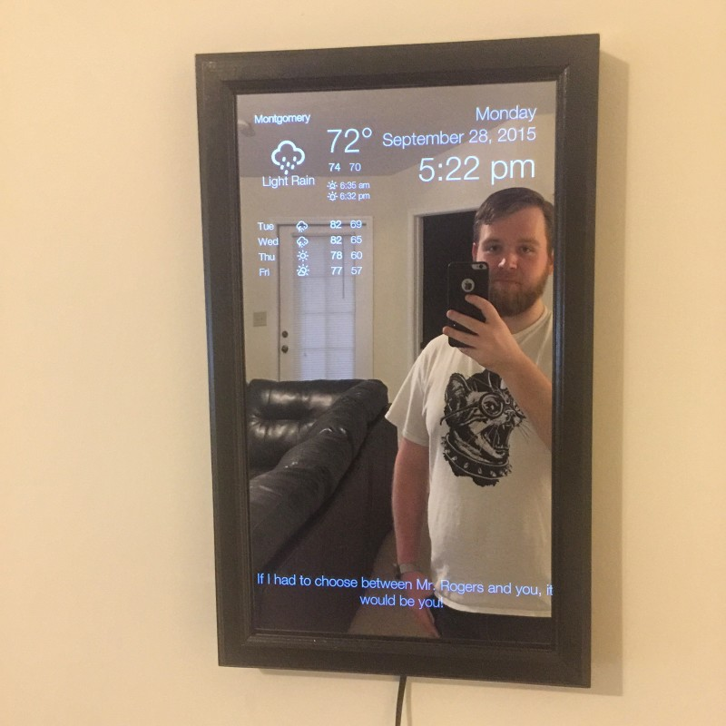

The Raspberry Pi-powered Magic Mirror offers a multifunctional display that presents time, weather, calendar events, and personal notifications through a two-way mirror, blending seamlessly with home decor. This innovative use of the Raspberry Pi not only serves as a personalized information hub but also introduces users to DIY electronics and coding, fostering creativity and technical skills while enhancing daily routines with smart technology.

{: width="33%"}
{: style="text-align:center"}
{: width="75%"}
{: style="text-align:center"}