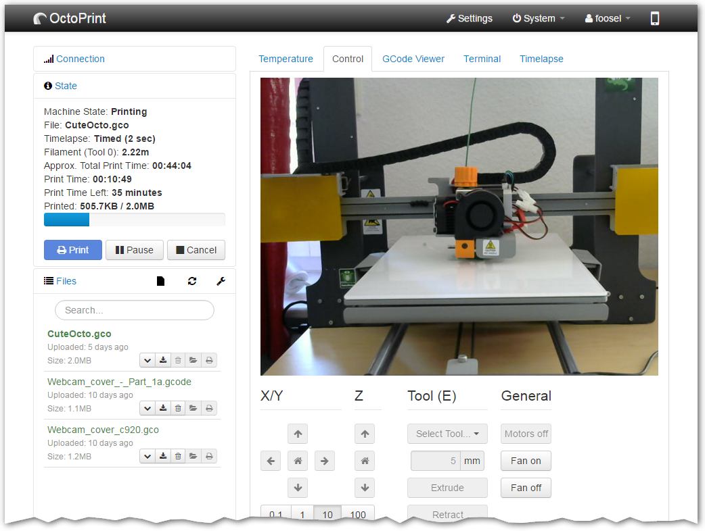
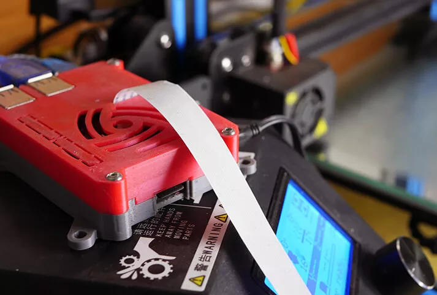

OctoPrint transforms a 3D printer into a network-connected device, enabling remote monitoring and control of 3D printing jobs via a web interface, thereby enhancing the efficiency and accessibility of the printing process. Undertaking an OctoPrint project teaches valuable skills in networking, software installation and configuration on Raspberry Pi, and 3D printing management, offering a hands-on experience with IoT (Internet of Things) technologies and practical problem-solving in additive manufacturing.

{: width="75%"}
{: style="text-align:center"}
{: width="75%"}
{: style="text-align:center"}